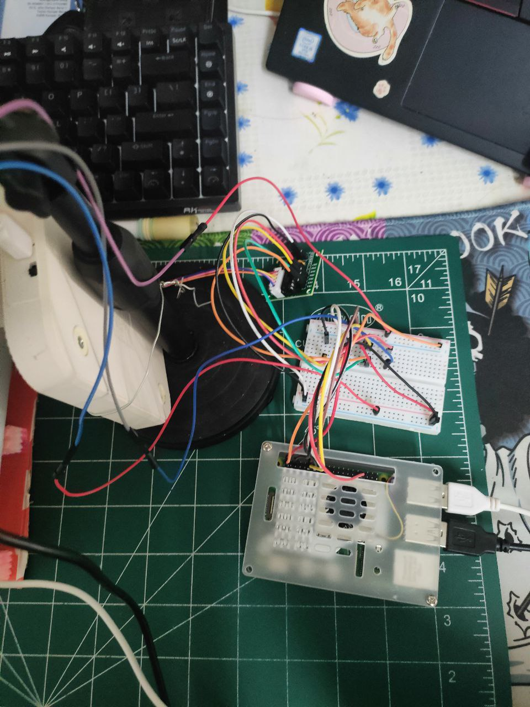
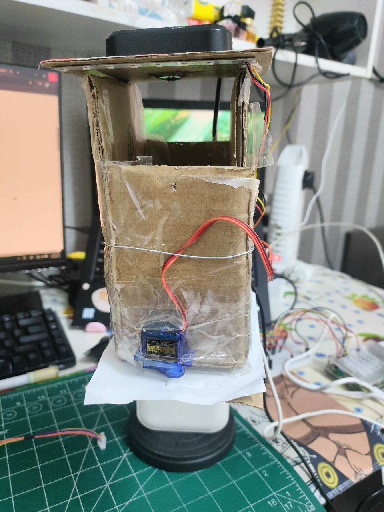
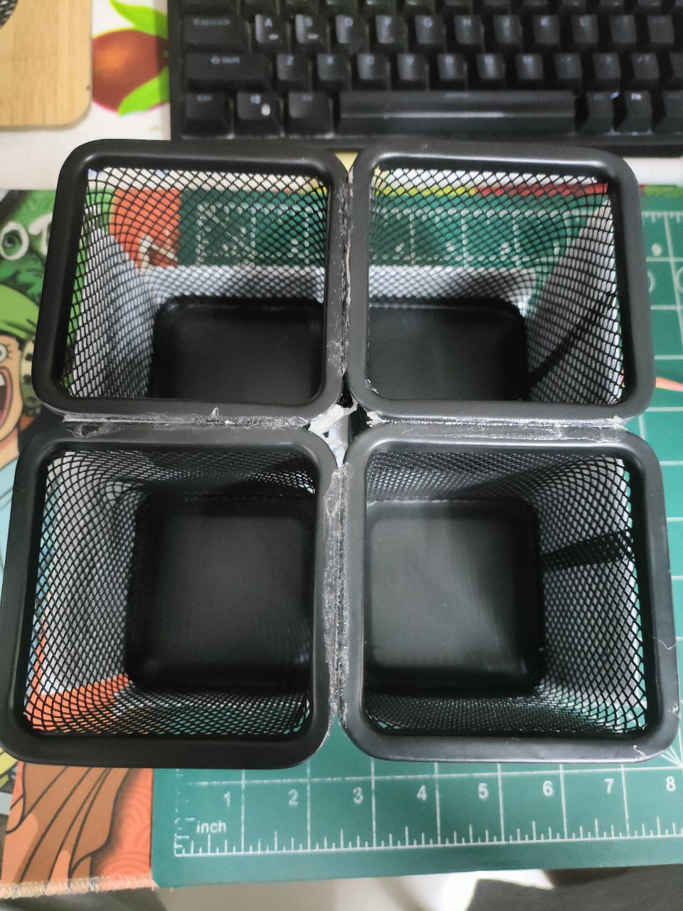
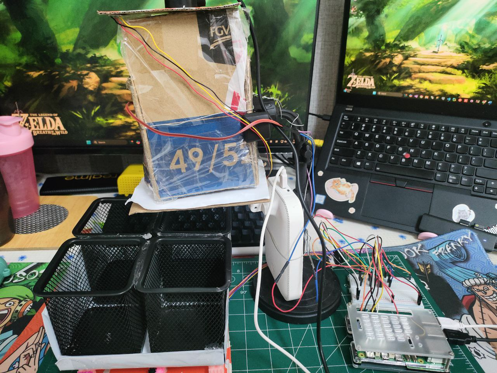

# Waste Classification App
A Raspberry Pi-based intelligent waste classification system that detects and sorts garbage in real-time and this project is mainly for UCCE3073 Computer Vision and Image Processing subject.

## Installation
1. Clone this repository
2. Download Python Version 3.11.2
3. Download Visual Studio Code
    - create virtual enviroment based on python 3.11.2
    - at the top search bar, type '>Python: Create Enviroment'
    - choose 'Venv'
    - select python version 3.11.2
    - open terminal and activate the virtual enviroment
    - run 'pip3 install -r requirements.txt' to download all packages
4. Download XLaunch (if you wanna debug and code in linux enviroment)

## To debug
1. Open Home.py
2. Click 'Start Debugging'

## To build
1. Open terminal
2. Acitvate the virtual enviroment
3. Run 'pyinstaller --noconsole --name "waste classification app" --add-data "waste_classifier.pth:." --add-data "Background.jpg:." Home.py'
4. The exe file will be contain at 'dist' folder (Don't move the file and folder inside the dist folder)

## General function
1. There will be a UI build using customtkinter
2. At the same time, it will generate a folder call AppSettings
3. Click 'Connect' button to start the camera
4. The camera will start capture and detect motion to make sure it start to classify when there is obejct present
5. When object is detected, it will capture the image of the object
6. Then perform segmentation to carry out the object with additional information like dominant color and object mask also
7. Af the same time, it will genereate a folder call  'WasteClassificationAppLog', inside this folder log message and every image of being captured or being segmented will save in here
8. You can click 'Disconnect' button to stop the camera and classification process
9. You can also click the '>>' button to modify the app settings value 

## If running in Windows
1. Servo Motor and Stepper Motor can't be used
2. No need to download XLaunch
3. This program will become waste recognition program only

## If running in Linux (Raspberry Pi)
1. Download XLaunch
2. Download SSH extension in VS Code
3. Open XLaunch click 'next' -> 'next' -> Remember to tick the 'Disable Access Control' -> Finish
4. In VS Code, open '...\.ssh\config' file
5. Include the 'ForwardX11 yes' and 'ForwardX11Trusted yes'
6. Exp:
    - Host raspberrypi
        - HostName raspberrypi
        - User alexfong
        - ForwardX11 yes
        - ForwardX11Trusted yes
7. In Raspberry PI, open terminal and type 'sudo nano /etc/ssh/sshd_config'
8. Change and Uncomment the line  'ForwardX11 yes' and 'ForwardX11Trusted yes'
9. Back to your VS Code, SSH into the raspberry pi and you can start to run this program

## Raspberry PI gpio pin setup
1. By default, this program is set to communicate with the 
    - servo motor using pin 13
    - stepper motor using pin 17(IN1), 18(IN2), 27(IN3), 22(IN4)
2. Rememeber to provide 5V power supply and GND to the stepper motor driver and servo motor 

# Cautions
1. This program is run under certain conditions:
    - since the dataset is capture in a fixed background, therefore the recognize process can be done with high accurate only in same background

# Image of the physical structure
-  the raspberry pi 5 and the wiring
- 

- the view of dustbin attach with a servo motor
- 

- the view of basket dustbin that correspond to plastic, steel, paper and other categories, a stepper motor is install below to rotate the basket dustbin
- 

- overall of whole prototype
- 